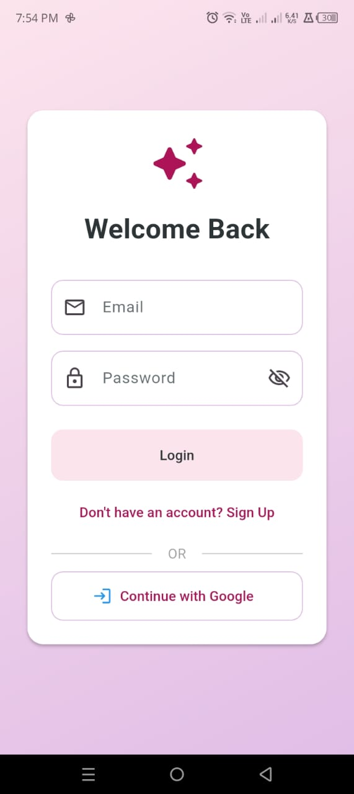
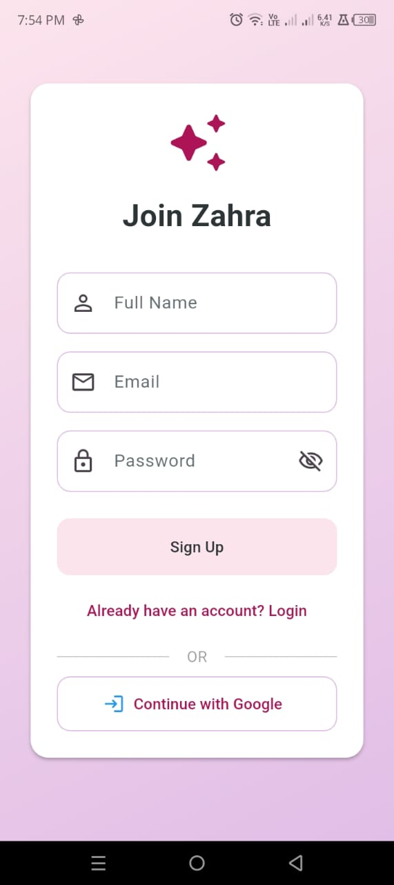
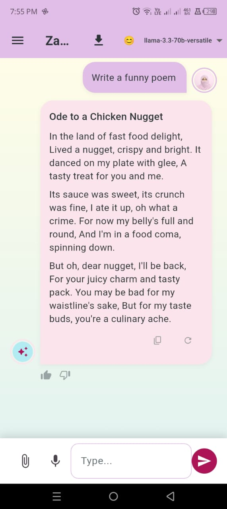
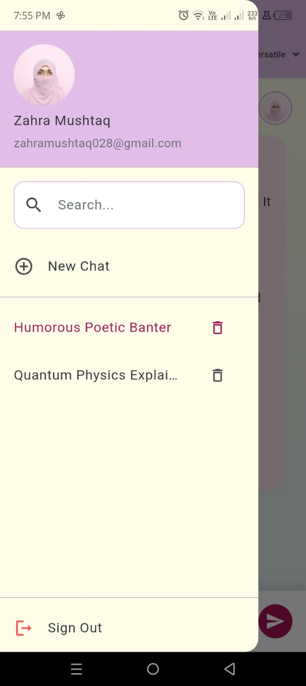
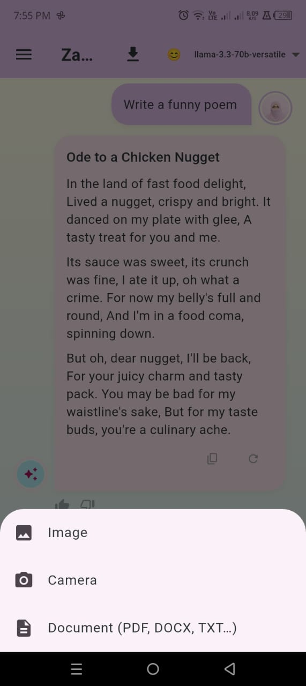
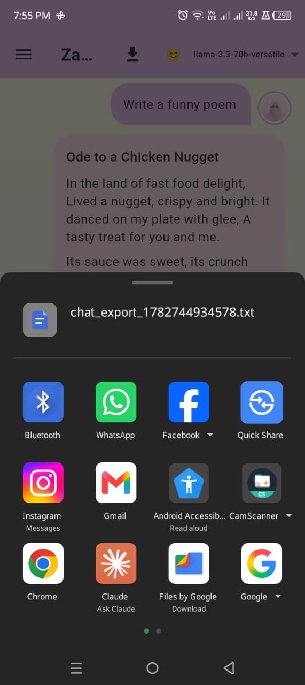

<div align="center">

# ✨ Zahra AI — Cross-Platform Flutter AI Chat Assistant

**A production-grade, multi-model AI chatbot built with Flutter, Firebase, and Groq/Gemini APIs — featuring real-time streaming responses, persona switching, file intelligence, and full authentication.**

[](https://flutter.dev)
[](https://dart.dev)
[](https://firebase.google.com)
[](https://riverpod.dev)
[](https://groq.com)
[](LICENSE)
[](#-supported-platforms)

[Features](#-key-features) • [Architecture](#-architecture-overview) • [Screenshots](#-screenshots) • [Getting Started](#-getting-started) • [Tech Stack](#-tech-stack) • [Roadmap](#-roadmap) • [Contributing](#-contributing)

</div>

---

## 📖 About The Project

**Zahra AI** is a full-stack, cross-platform AI chat assistant built with **Flutter** and **Clean Architecture** principles. It integrates multiple large language model providers (**Groq — Llama 3.3 70B, Llama 3.1 8B, Mixtral, Qwen 2.5** and **Google Gemini Vision**) into a single, polished chat experience with real-time token streaming, persistent chat history via **Cloud Firestore**, and secure authentication through **Firebase Auth** (Email/Password + Google Sign-In).

Unlike a typical "wrapper" chatbot demo, this project is structured the way production Flutter apps are built: feature-first folder structure, Riverpod for reactive state management, a dedicated service layer for API/network calls, and platform-ready builds for **Android, iOS, Web, Windows, macOS, and Linux** from a single codebase.

> Built as a portfolio-grade demonstration of scalable Flutter architecture, multi-LLM integration, and real-time streaming UX.

---

## 🚀 Key Features

| Category | Feature |
|---|---|
| 🔐 **Authentication** | Firebase Auth with Email/Password + Google Sign-In, persistent session handling |
| ⚡ **Real-Time Streaming** | Token-by-token AI response streaming with an instant **Stop Generation** control |
| 🧠 **Multi-Model AI Engine** | Hot-swap between Groq models (`llama-3.3-70b-versatile`, `llama-3.1-8b-instant`, `mixtral-8x7b`, `qwen-2.5-32b`) and Gemini Vision |
| 🎭 **AI Personas** | Switchable personality modes — Helpful, Creative, Technical, Poetic — each with tuned system prompts |
| 💬 **Persistent Chat History** | Multi-session chat storage and retrieval via Cloud Firestore, with live search across past conversations |
| 📎 **File Intelligence** | Upload and parse **images, PDFs, and DOCX** files directly into the conversation context |
| 🎙️ **Voice Input** | Native speech-to-text dictation for hands-free prompting |
| 📤 **Export & Share** | Export any conversation to `.txt` and share instantly via WhatsApp, Gmail, Bluetooth, etc. |
| 🌗 **Adaptive Theming** | Fully reactive Light/Dark theme toggle powered by Riverpod `StateNotifier` |
| 📝 **Markdown Rendering** | Rich Markdown rendering for AI responses (code blocks, lists, headings) |
| 👤 **Profile Management** | Dedicated profile screen for account and session management |
| 🌍 **Cross-Platform** | Single codebase deployed to Android, iOS, Web, Windows, macOS, and Linux |

---

## 🏗️ Architecture Overview

This project follows a **feature-first, Clean Architecture-inspired** structure, separating UI, state, and data concerns for scalability and testability.

```
lib/
├── core/                     # App-wide config, theming, constants
│   ├── config.dart           # Environment & API configuration (.env driven)
│   ├── theme.dart             # Light/Dark ThemeData definitions
│   └── theme_provider.dart    # Riverpod ThemeMode state notifier
│
├── features/                 # Feature-first modules
│   ├── auth/
│   │   ├── providers/         # Auth state (Riverpod StreamProvider on FirebaseAuth)
│   │   └── views/             # Login / Sign-up screens
│   ├── chat/
│   │   ├── providers/         # Chat + persona state notifiers, streaming logic
│   │   ├── views/             # Main chat UI
│   │   └── widgets/           # Message bubble & reusable chat widgets
│   └── profile/
│       └── views/             # User profile screen
│
├── shared/
│   ├── models/                 # Msg, ChatSession — Firestore-serializable data models
│   └── services/               # AIService (Groq/Gemini), FirebaseService (Auth/Firestore/Storage)
│
├── firebase_options.dart       # Auto-generated FlutterFire config
└── main.dart                   # App entry point & provider scope
```

**Data flow at a glance:**

```
User Input → ChatNotifier (Riverpod) → AIService → Groq/Gemini API
                                              ↓
                                     Streamed tokens → UI (live)
                                              ↓
                                  FirebaseService → Cloud Firestore (persisted)
```

**Why this architecture?**
- **Separation of concerns** — UI never talks to Firebase or the AI API directly; everything routes through providers and services.
- **Testability** — Services and notifiers are decoupled from widgets, making unit testing straightforward.
- **Scalability** — Adding a new LLM provider or feature module doesn't require touching unrelated code.

---

## 📱 Screenshots

<div align="center">

| Login | Sign Up | Chat (Streaming) |
|:---:|:---:|:---:|
|  |  |  |

| Chat History & Search | Attach Files | Export & Share |
|:---:|:---:|:---:|
|  |  |  |

</div>

> 📸 Replace these with your latest build screenshots any time — just drop new images into `/screenshots` using the same filenames, or update the paths above.

---

## 🧰 Tech Stack

**Frontend / Framework**
- [Flutter](https://flutter.dev) 3.x · [Dart](https://dart.dev) 3.11

**State Management**
- [flutter_riverpod](https://pub.dev/packages/flutter_riverpod) 2.6 · `riverpod_annotation`

**Backend / Cloud**
- [Firebase Auth](https://firebase.google.com/docs/auth) · [Cloud Firestore](https://firebase.google.com/docs/firestore) · [Firebase Storage](https://firebase.google.com/docs/storage) · Google Sign-In

**AI / LLM Providers**
- [Groq API](https://groq.com) — Llama 3.3 70B, Llama 3.1 8B, Mixtral 8x7B, Qwen 2.5 32B
- [Google Gemini](https://ai.google.dev) — Gemini Vision

**File & Media Handling**
- `file_picker` · `image_picker` · `syncfusion_flutter_pdf` · `archive` (DOCX/ZIP parsing) · `speech_to_text` · `share_plus`

**Utilities**
- `flutter_dotenv` (secure env config) · `flutter_markdown` · `connectivity_plus` · `path_provider` · `uuid` · `intl`

---

## 🖥️ Supported Platforms

| Android | iOS | Web | Windows | macOS | Linux |
|:---:|:---:|:---:|:---:|:---:|:---:|
| ✅ | ✅ | ✅ | ✅ | ✅ | ✅ |

---

## ⚙️ Getting Started

### Prerequisites

- [Flutter SDK](https://docs.flutter.dev/get-started/install) `>= 3.11`
- A [Firebase](https://console.firebase.google.com) project (Auth + Firestore enabled)
- A free [Groq API key](https://console.groq.com/keys)
- A [Google Gemini API key](https://aistudio.google.com/app/apikey) (optional, for vision features)

### 1. Clone the repository

```bash
git clone https://github.com/zahra01-m/zahra-ai-chatbot.git
cd zahra-ai-chatbot
```

### 2. Install dependencies

```bash
flutter pub get
```

### 3. Configure environment variables

Create a `.env` file in the project root (this file is **git-ignored** and never committed):

```env
GROQ_KEY=your_groq_api_key_here
GEMINI_KEY=your_gemini_api_key_here
GOOGLE_CLIENT_ID=your_google_oauth_client_id_here
```

### 4. Connect Firebase

Install the [FlutterFire CLI](https://firebase.google.com/docs/flutter/setup) and run:

```bash
dart pub global activate flutterfire_cli
flutterfire configure
```

This regenerates `lib/firebase_options.dart` for your own Firebase project.

### 5. Run the app

```bash
flutter run
```

To target a specific platform:

```bash
flutter run -d chrome      # Web
flutter run -d windows     # Windows
flutter run -d macos       # macOS
```

### 6. Build a release

```bash
flutter build apk --release        # Android
flutter build ios --release        # iOS
flutter build web --release        # Web
```

---

## 🔒 Security Notes

- API keys are loaded via `flutter_dotenv` and **never hard-coded** in source.
- `.env` is included in `.gitignore` — always double-check it isn't tracked before pushing.
- Firebase security rules should restrict Firestore reads/writes to authenticated users only (see `firestore.rules` if included, or configure via the Firebase Console).

---

## 🗺️ Roadmap

- [ ] Group/shared chat sessions
- [ ] Offline response caching
- [ ] In-app model usage analytics dashboard
- [ ] Custom persona builder (user-defined system prompts)
- [ ] Push notifications for async AI replies

---

## 🤝 Contributing

Contributions, issues, and feature requests are welcome!

1. Fork the project
2. Create your feature branch (`git checkout -b feature/AmazingFeature`)
3. Commit your changes (`git commit -m 'Add some AmazingFeature'`)
4. Push to the branch (`git push origin feature/AmazingFeature`)
5. Open a Pull Request

Please open an issue first for major changes to discuss what you'd like to change.

---

## 📄 License

Distributed under the MIT License. See `LICENSE` for more information.

---

## 👩‍💻 Author

**Zahra Mushtaq**
Flutter Developer · BS Computer Science, COMSATS University Islamabad

- GitHub: [@zahra01-m](https://github.com/zahra01-m)
- LinkedIn: [zahra-mushtaq-](https://www.linkedin.com/in/zahra-mushtaq-)

<div align="center">

### ⭐ If you found this project useful, consider giving it a star!

**Keywords:** Flutter Developer Portfolio · Flutter AI Chatbot · Firebase Flutter App · Riverpod State Management · Groq API Integration · Cross-Platform Mobile App · Clean Architecture Flutter · LLM Chat Application · Flutter Firebase Authentication

</div>
